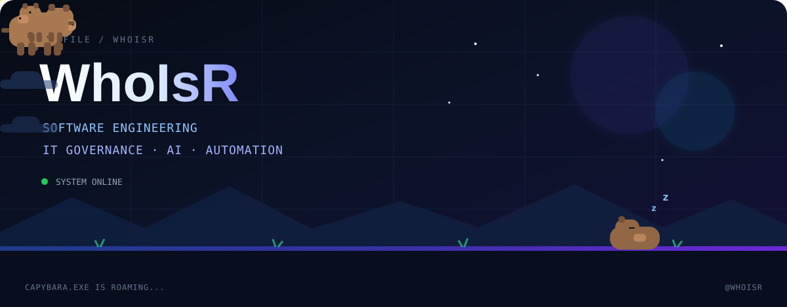

<p align="center">
  
</p>

<p align="center">
  <a href="https://github.com/WhoIsR">
    
  </a>
  <a href="https://www.linkedin.com/in/USERNAME-LINKEDIN/">
    
  </a>
  <a href="https://instagram.com/USERNAME-INSTAGRAM">
    
  </a>
  <a href="mailto:EMAIL-KAMU">
    
  </a>
</p>

<p align="center">
  
</p>

---

## About Me

```text
Name     : Radja
Handle   : @WhoIsR
Location : Indonesia

Focus
├── Software Engineering
├── IT Governance
├── Artificial Intelligence
└── Automation
```

Interested in building systems that are useful, understandable, maintainable, and actually worth using.

---

## GitHub Signal

<p align="center">
  
</p>

<p align="center">
  
</p>

<p align="center">
  
  
</p>

---

## Contribution Activity

<p align="center">
  <picture>
    <source
      media="(prefers-color-scheme: dark)"
      srcset="https://raw.githubusercontent.com/WhoIsR/WhoIsR/output/github-contribution-grid-snake-dark.svg"
    />
    <source
      media="(prefers-color-scheme: light)"
      srcset="https://raw.githubusercontent.com/WhoIsR/WhoIsR/output/github-contribution-grid-snake.svg"
    />
    
  </picture>
</p>

---

<details>
<summary><b>More</b></summary>

<br>

```text
Principles

• Understand before automate
• Keep systems maintainable
• Governance should reduce confusion
• Build useful things, not impressive demos
```

</details>
