<p align="center">
  
</p>

<p align="center">
  <samp>BUILD · UNDERSTAND · SECURE · AUTOMATE</samp>
</p>

<br>

<details open>
<summary><samp><b>01 / IDENTITY</b></samp></summary>

<br>

```text
NAME      Radja
HANDLE    @WhoIsR

DOMAINS
├── Software Engineering
├── Cybersecurity
├── Artificial Intelligence
└── Automation & Systems
```

I like systems that are useful, understandable, and worth maintaining.

</details>

<br>

<details>
<summary><samp><b>02 / SYSTEM MAP</b></samp></summary>

<br>

```text
                     ┌─────────────────┐
                     │     WHOISR      │
                     └────────┬────────┘
                              │
              ┌───────────────┼───────────────┐
              │               │               │
              ▼               ▼               ▼
        ┌──────────┐    ┌──────────┐    ┌──────────┐
        │ SOFTWARE │    │ SECURITY │    │    AI    │
        └─────┬────┘    └─────┬────┘    └─────┬────┘
              │               │               │
              └───────────────┼───────────────┘
                              ▼
                       ┌────────────┐
                       │ AUTOMATION │
                       └────────────┘
```

</details>

<br>

<details>
<summary><samp><b>03 / CONSOLE</b></samp></summary>

<br>

```console
$ whoami
radja

$ cat principles.txt

understand before automate
security is part of the design
simplicity has to be earned
build things worth maintaining

$ _
```

</details>

<br>

### `04 / ACTIVITY SIGNAL`

<picture>
  <source
    media="(prefers-color-scheme: dark)"
    srcset="https://raw.githubusercontent.com/WhoIsR/WhoIsR/output/github-contribution-grid-snake-dark.svg"
  />
  <source
    media="(prefers-color-scheme: light)"
    srcset="https://raw.githubusercontent.com/WhoIsR/WhoIsR/output/github-contribution-grid-snake.svg"
  />
  
</picture>

<br>

<p align="center">
  <samp>WHOISR / END OF TRANSMISSION</samp>
</p>
